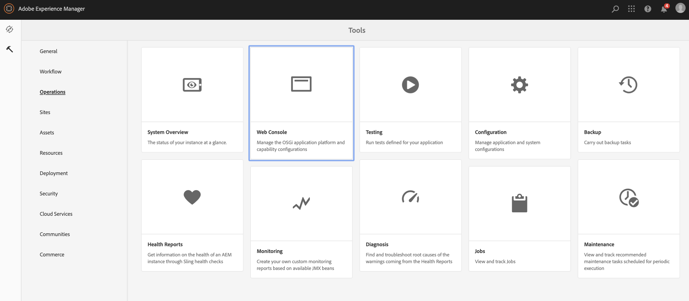
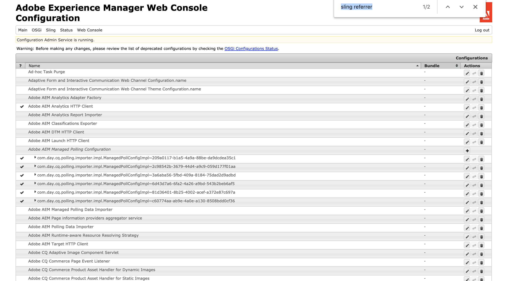
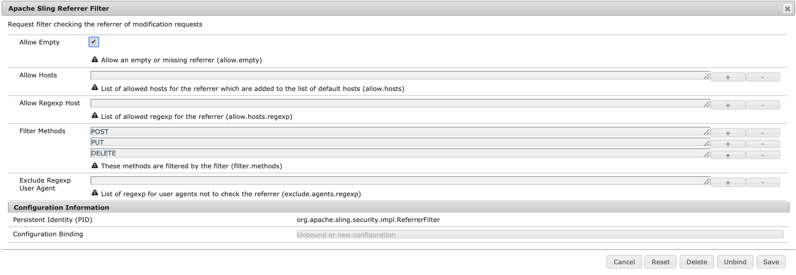

# Configuring and Deploying AEM Screens {#configuring-and-deploying-aem-screens}

This page shows how to install and configure the Screens players on your devices.

## Server Configuration {#server-configuration}

>[!NOTE]
>
>**Important**:
>
>AEM Screens player does not make use of the Cross-Site Request Forgery (CSRF) token. Therefore, in order to configure and AEM server to be ready to use for AEM Screens, skip the referrer filter by allowing empty referrers.

### Prerequisites {#prerequisites}

The following key points below helps to configure and AEM server to be ready to use for AEM Screens:

#### Allow Empty Referrer Requests {#allow-empty-referrer-requests}

1. Navigate to **Adobe Experience Manager Web Console Configuration **via AEM instance --&gt; hammer icon --&gt; **Operations** --&gt; **Web Console**.

   

1. **Adobe Experience Manager Web Console Configuration** opens. Search for sling referrer.

   For searching the sling referrer property, press **Command+F** for **Mac** and **Control+F** for **Windows**.

   

1. Check the **Allow Empty **option, as shown in the figure below.

   

1. Click **Save** to enable the Apache Sling Referrer Filter Allow Empty.

#### Enable Touch UI for AEM Screens {#enable-touch-ui-for-aem-screens}

AEM Screens requires TOUCH UI and will not work with CLASSIC UI of Adobe Experience Manager (AEM).

1. Navigate to *&lt;yourAuthorInstance&gt;/system/console/configMgr/com.day.cq.wcm.core.impl.AuthoringUIModeServiceImpl*
1. Ensure that the **Default authoring UI mode** is set to **TOUCH**, as shown in the figure below

Alternatively, you can also perform the same setting using*&lt;yourAuthorInstance&gt; *-&gt;* tools (hammer icon)* -&gt; **Operations** -&gt;** Web Console** and search for **WCM Authoring UI Mode Service**.

>[!NOTE]
>
>You can always enable Classic UI for specific users using user preferences.

#### AEM in NOSAMPLECONTENT runmode {#aem-in-nosamplecontent-runmode}

Running AEM in production uses the **NOSAMPLECONTENT** runmode. Removethe*X-Frame-Options=SAMEORIGIN* header (in the additional response header section) from

`https://localhost:4502/system/console/configMgr/org.apache.sling.engine.impl.SlingMainServlet`.

This is required for the AEM Screens Player to play online channels.

#### Password Restrictions {#password-restrictions}

With latest changes to ***DeviceServiceImpl***, you do not have to remove the password restrictions.

You can configure ***DeviceServiceImpl*** from the link below to enable password restriction while creating the password for the screens device users:

`https://localhost:4502/system/console/configMgr/com.adobe.cq.screens.device.impl.DeviceService`

Follow the steps below to configure ***DeviceServiceImpl***:

1. Navigate to **Adobe Experience Manager Web Console Configuration **via AEM instance --&gt; hammer icon --&gt; **Operations** --&gt; **Web Console**.

1. **Adobe Experience Manager Web Console Configuration **opens. Search for deviceservice. For searching the property, press **Command+F** for **Mac** and **Control+F** for **Windows**.

#### Dispatcher Configuration {#dispatcher-configuration}

To learn how to configure dispatcher for an AEM Screens project, refer to [Configuring Dispatcher for an AEM Screens project](dispatcher-configurations-aem-screens.md).

#### Java encoding {#java-encoding}

Set the ***Java encoding*** to Unicode. For example, *Dfile.encoding=Cp1252* will not work.

>[!NOTE]
>
>**Recommendation:**
>
>It is recommended to use HTTPS for AEM Screens Server in production use.

