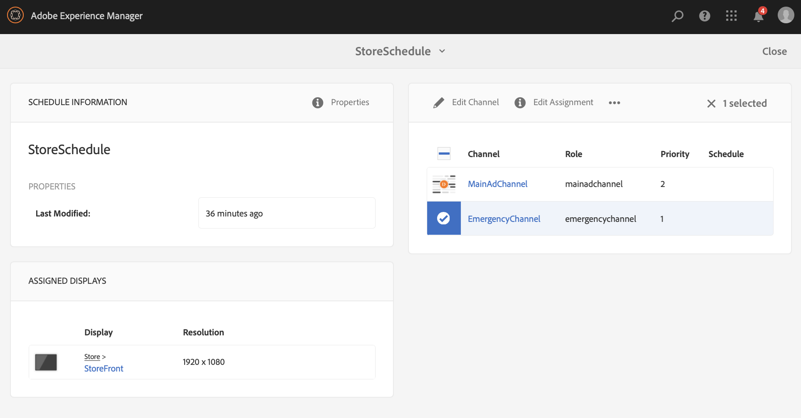

# Emergency Channel {#emergency-channel}

## Use Case Description {#use-case-description}

This section describes a use case example that emphasizes on creating and managing an emergency channel that the content author can switch from a sequence channel in case of a precondition.

### Preconditions {#preconditions}

Before you start this use case, make sure you understand how to:

* **[Create and Manage Channels](managing-channels.md)**
* **[Create and Manage Locations](managing-locations.md)**
* **[Create and Manage Schedules](managing-schedules.md)**
* **[Device Registration](device-registration.md)**

### Primary Actors {#primary-actors}

Content Authors

## Basic Flow: Setting up the Project {#basic-flow-setting-up-the-project}

Follow the steps below to set up an emergency channel:

1. Create an AEM Screens Project named as **EmergencyChannel**, as shown below.

   >[!NOTE]
   >
   >To learn more about creating and managing projects in AEM Screens, refer to Creating a Project.

   

1. **Creating a Sequence Channel**

    1. Select the **Channels** folder and click **Create** to open the wizard to create a channel.

    1. Select **Sequence Channel **from the wizard and create the channel titled as **MainAdChannel**.

   

1. **Adding Content to Sequence Channel**

    1. Select the channel (**MainAdChannel**).
    1. Click **Edit** from the action bar to open the editor. Drag and drop few assets to your channel.

   

1. **Creating an Emergency Channel**

    1. Select the **Channels** folder.
    1. Click on **Create** to open the wizard to create a channel.
    1. Select **Sequence Channel **from the wizard and create the channel titled as **EmergencyChannel**.

   >[!NOTE]
   >
   >Normally, your emergency channel is added to your pre-existing production project.

   

1. **Adding Content to Emergency Channel**

    1. Select the channel (**Emergency Channel)**.
    1. Click **Edit** from the action bar to open the editor. Drag and drop the asset that you want to run during an emergency to your channel.

   

1. **Creating a Location**

    1. Navigate to **Locations** folder.
    1. Click **Create** from the action bar and create a location titled **Store** from the wizard.

   

1. **Creating Displays in your Location**

   Navigate to your location (**Store**) and click **Create** from the action bar. Follow the wizard to create two **Displays** titled as **StoreFront** and **StoreRear**.

   

1. **Creating a Schedule**

    1. Navigate to your **Schedules** folder.
    1. Click **Create** from the action bar. Follow the wizard to create a schedule titled as **StoreSchedule**.

   

1. Assign both the Displays to your Schedule and set Priorities

    1. Select the schedule** (StoreSchedule)** and click **Dashboard** from the action bar.

    1. Click **+ Assign Channel** from the **ASSIGNED CHANNELS **panel.

    1. From the **Channel Assignment** dialog box:

        1. Select the path to the **MainAdChannel**
        1. Set the **Priority** as 2
        1. Set the Supported Events as **Initial Load** and **Idle Screen**.
        1. Click **Save**

       Similarly, you will have to follow the same steps again to assign the **EmergencyChannel** and set its **Priority**.

   >[!NOTE]
   >
   >Priority is used to order the assignments in case multiple ones match the playing criteria. The one with the highest value will always take precedence over lower values.

   

1. Click **+ Assign Channel** from the **ASSIGNED CHANNELS **panel.

1. From the **Channel Assignment** dialog box:

    1. Select the path to the **EmergencyChannel**
    1. Set the **Priority** as 1

    1. Set the Supported Events as **Initial Load**, **Idle Screen**, and **User Interaction**

    1. Click **Save**

   

   You can view the assigned channels from the **StoreSchedule** dashboard.

   

1. **Assigning Schedule to each Display**

    1. Navigate to the each display, such as **EmergencyChannel** --&gt; **Locations** --&gt; **Store **--&gt;**StoreFront**.

    1. Click **Dashboard** from the action to open the display dashboard.
    1. Click **...** from the **ASSIGNED CHANNELS & SCHEDULES** panel and further click **+Assign Schedule**.

    1. Select the path to the Schedule (for example, here, **EmergencyChannel** --&gt; **Schedules** --&gt;**StoreSchedule**).

    1. Click **Save**.

   You can view the assigned schedule to the display from the **StoreSchedule** dashboard.
   

1. **Device Registration**

   Complete the device registration process and once you have registered you will view the following output on your AEM Screens player.

   

## Switching to Emergency Channel {#switching-to-emergency-channel}

In the event of an emergency perform the following steps:

1. Navigate to **EmergencyChannel** --&gt; **Schedules** --&gt; **StoreSchedule** and select **Dashboard** from the action bar.

   

1. Select the **EmergencyChannel** from the **StoreSchedule** dashboard and click **Edit Assignment**.

   

1. Update the **Priority** of the **EmergencyChannel** to **3** from the **Channel Assignment** dialog box and click **Save**.

   

1. As soon as the priority of the channel is updated, all the AEM Screens player will display the **EmergencyChannel** content, as shown below.

   

### Conclusion {#conclusion}

The **EmergencyChannel** will continue to display its content until the content author resets the Priority Value to 1.

Once the content author receives the instructions that the emergency has been cleared, he/she should update the priority of the **MainAdChannel** which will cause normal playback to resume.
