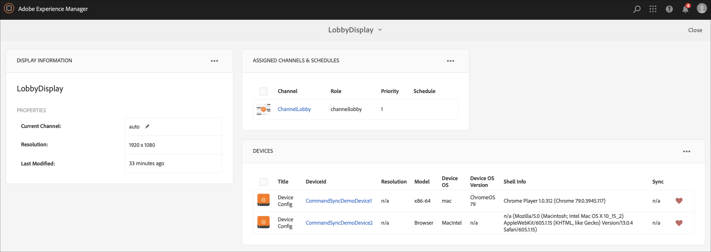

# Command Sync {#command-sync}

The following page describes how to use Command Sync. Command Sync allows synchronized playback across different players. The players can play different content but each asset needs to have the same duration.

## Overview {#overview}

Digital signage solutions need to support video walls and synchronized playback to support scenarios like New Year countdowns or large video sliced up to play across multiple screens and this is where Command Sync comes into play.

To use Command Sync, one player acts as a *master* and sends command and all the other players act as *clients* and play when they receive the command. 

The *master* sends a command to all registered clients when it is about to start playback of an item. The payload of this can be the index of the item to be played and/or the outer html of the element to be played.

## Implementing Command Sync {#using-command-sync}

The following section describbes how you can use Command Sync in an AEM Screens project.

### Setting up the Project {#setting-up}

Before you use Command Sync feature, make sure you have a project and a channel with content set up for your project.

1. The following example showcases a demo project named **CommandSyncDemo** and a sequence channel **ChannelLobby**.

   

   >[!NOTE]
   >
   >To learn how to create a channel or add content to a channel, refer to [Creating and Managing Channels](/help/user-guide/managing-channels.md)

   The channel contains the following content, as shown in the figure below.

   

1. Create a display in the **Locations** folder, as shown in the figure below.
   

1. Assign the channel, **ChannelLobby** to your **LobbyDisplay**.
    

   >[!NOTE]
   >
   >To learn how to assign a channel to a display, refer to [Creating and Managing Displays](/help/user-guide/managing-displays.md)

1. Navigate to **Devices** folder and click **Device Manager** from the action bar to register the devices.

   

   >[!NOTE]
   >
   >To learn how to assign a channel to a display, refer to [Creating and Managing Displays](/help/user-guide/managing-displays.md)

1. For demo purposes, this example showcases a chrome device and a web player as two separate devices. Both the devices point to the same display.
   

### Setting up a Master {#setting-up-master}

1. Navigate to the display dashboard from **CommandSyncDemo** --> **Locations**  --> **Lobby** --> **LobbyDisplay** and click on **Dashboard** from the action bar.
You will see the two devices (chrome and windows player) in **DEVICES** panel, as shown in the figure below.

   

1. From the **DEVICES** panel,select the device you want to set as master. The following example demonstrates setting up the Chrome device as the master. Click on **Set as master device**.

   

1. Enter the IP address in **Set as master device** and click on **Save**. 

   

### Syncing up with Master {#sync-up-master}

1. Once you have set the Chrome device as master, you can sync the other device to sync with the master.
Select the other device from the **DEVICES** panel and click on **Sync to master device**, as shown in the figure below.

1. Select the device from the list and click **Save**.

1. Navigate to the [Web Player](http://localhost:4502/screens/player.html).

